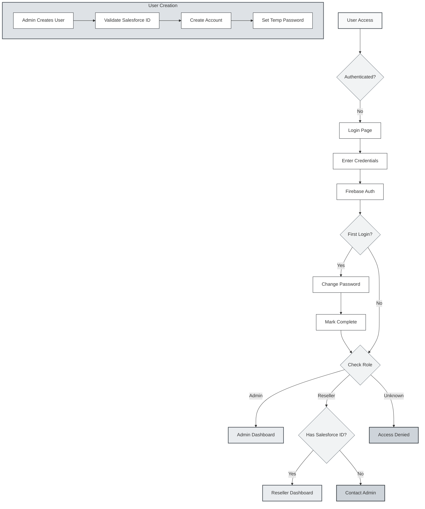

# TwogetherApp Authentication Flow

This diagram illustrates the complete authentication and user management flow in TwogetherApp, from admin-controlled user creation to role-based access control.

## Key Authentication Features

### 🔑 **Core Security Principles**
- **Admin-Controlled User Creation**: No self-registration allowed
- **Mandatory Salesforce Integration**: Resellers must have valid Salesforce ID
- **First Login Security**: Forced password change with temporary credentials
- **Role-Based Access Control**: Granular permissions via Firestore rules

### 🏗️ **Technical Implementation**
- **Firebase Authentication**: Core identity management
- **Cloud Functions**: Server-side user creation and management
- **Firestore Security Rules**: Document-level access control
- **Flutter Secure Storage**: Encrypted credential persistence

### 🔄 **User Lifecycle**
1. **Creation**: Admin initiates through management interface
2. **Provisioning**: System validates Salesforce ID and creates accounts
3. **First Access**: User changes temporary password
4. **Role Assignment**: System routes based on admin/reseller role
5. **Session Management**: Automatic token refresh and security validation

### 📋 **Compliance & Audit**
- All user creation events logged with admin attribution
- Password change history tracked for security compliance
- Session activity monitored for unauthorized access detection
- Salesforce synchronization maintains data integrity audit trail 