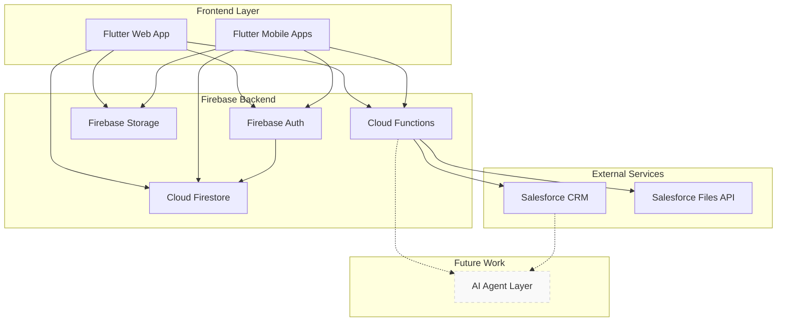
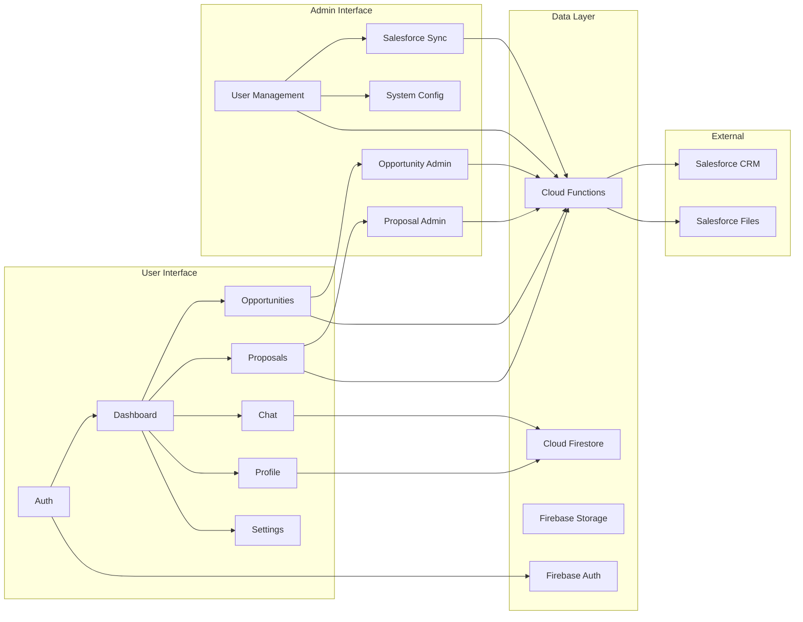
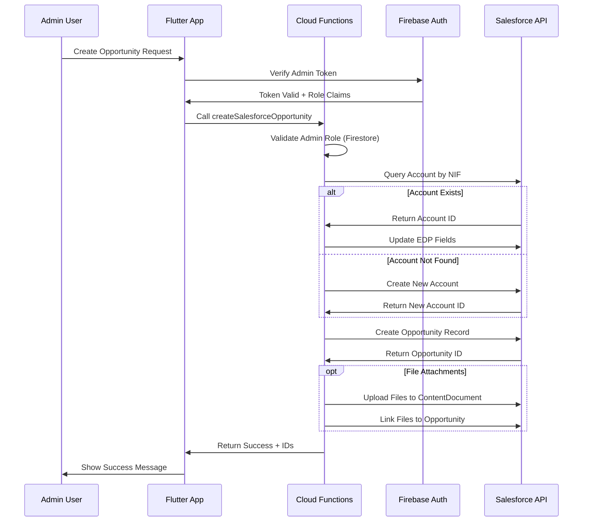

# Chapter 4: System Implementation

## Repo Map

### A. Top-Level Directory Structure and Key Configuration Files

**Top-level directories:**
- `lib/` - Flutter application source code
- `functions/` - Firebase Cloud Functions (TypeScript/Node.js backend)
- `assets/` - Application assets (images, documents)
- `android/`, `ios/`, `web/`, `windows/`, `macos/`, `linux/` - Platform-specific configurations
- `build/` - Build output directory
- `test/` - Test files

**Key configuration files:**
- `pubspec.yaml` - Flutter dependencies and project configuration (182 lines)
- `firebase.json` - Firebase services configuration (63 lines)
- `firestore.rules` - Firestore security rules (150 lines)
- `firestore.indexes.json` - Firestore database indexes (33 lines)
- `storage.rules` - Firebase Storage security rules (54 lines)
- `analysis_options.yaml` - Dart linting configuration

### B. Estimated Lines of Code (LOC) by Major Folder

**Flutter Application (`lib/`):**
- `lib/main.dart` - 346 lines
- `lib/features/` - ~8,000-10,000 lines (12 feature modules)
- `lib/core/` - ~1,500-2,000 lines (shared utilities)
- `lib/widgets/` - ~2,000-3,000 lines (reusable components)
- `lib/presentation/` - ~1,500-2,000 lines (UI layer)
- **Total Flutter LOC: ~13,000-17,000 lines**

**Firebase Functions (`functions/src/`):**
- 32 TypeScript files with 166-1,231 lines each
- `index.ts` - 1,231 lines (main entry point)
- Business logic functions - ~200-400 lines each
- **Total Functions LOC: ~8,000-10,000 lines**

**Configuration and Scripts:**
- Platform configs - ~2,000-3,000 lines
- PowerShell scripts - ~3,000 lines
- Documentation - ~2,000 lines
- **Total Configuration LOC: ~7,000-8,000 lines**

**Project Total Estimated LOC: ~28,000-35,000 lines**

### C. Large Files for Summarisation (> 5,000 LOC)

No individual files exceed 5,000 lines. The largest files are:
- `functions/src/index.ts` (1,231 lines) - Cloud Functions entry point
- `pubspec.lock` (1,728 lines) - Dependency lock file
- `functions/package-lock.json` (9,678 lines) - Node.js dependency lock file

All files can be read line-by-line without summarisation.

### D. Context Window Assessment

✅ **Sufficient context window confirmed** for completing STEPs 1-7. The repository structure is well-organized with manageable file sizes, clear feature separation, and comprehensive documentation files that provide architectural context.

**PREP DONE**

## 4.1 Overview & Design Principles

### Business Problem Summary

The TwogetherApp addresses the complex challenge of managing renewable energy reseller relationships and opportunity pipelines. It streamlines the process of connecting energy resellers with corporate clients through integrated proposal management, real-time communication, and automated Salesforce synchronization, eliminating manual coordination overhead and reducing sales cycle friction.

### Architectural Design Principles

1. **Single Source of Truth**: Salesforce serves as the master data repository, with Firebase providing real-time UI synchronization and offline capabilities.

2. **Mobile-First Responsive Design**: Flutter framework ensures consistent experience across web, mobile, and desktop platforms with adaptive layouts.

3. **Role-Based Security Model**: Strict separation between admin (full Salesforce access via OAuth) and reseller (limited access via JWT) permissions with Firebase Authentication integration.

4. **Event-Driven Communication**: Real-time chat, notifications, and data updates leveraging Firestore's reactive streams for immediate user feedback.

5. **Microservices Architecture**: Modular Firebase Cloud Functions handle specific business logic, ensuring scalability and independent deployment cycles.

6. **API-First Integration**: Clean separation between frontend Flutter app and backend services, enabling future platform extensions and third-party integrations.

### High-Level System Architecture



**STEP 1 DONE**

## 4.2 Tech Stack Summary

### Core Technologies Table

| Category | Technology | Version/Specification |
|----------|------------|----------------------|
| **Language** | Dart | ^3.7.0 |
| **Framework** | Flutter | Latest stable SDK |
| **Backend Runtime** | Node.js | 22 |
| **Database** | Cloud Firestore | NoSQL document store |
| **Authentication** | Firebase Auth | Email/password + OAuth |
| **Storage** | Firebase Storage | File storage service |
| **Functions** | Firebase Cloud Functions | Serverless TypeScript |
| **Hosting** | Firebase Hosting | Static web hosting |
| **External API** | Salesforce REST API | v58.0 |

### Runtime Versions

- **Dart SDK**: ^3.7.0 (Flutter compatible)
- **Flutter SDK**: Latest stable (via `flutter` dependency)
- **Node.js**: v22 (Firebase Functions runtime)
- **Firebase SDK**: 
  - `firebase_core: ^3.13.0`
  - `firebase_auth: ^5.5.2`
  - `cloud_firestore: ^5.6.6`
  - `firebase_storage: ^12.4.5`
  - `cloud_functions: ^5.4.0`
  - `firebase_messaging: ^15.2.5`

### Major Third-Party Packages (>100★)

**State Management & Architecture:**
- `flutter_riverpod: ^2.5.1` - Reactive state management
- `go_router: ^15.1.1` - Declarative routing solution
- `equatable: ^2.0.5` - Value equality simplification

**UI & Design:**
- `google_fonts: ^6.1.0` - Custom typography (Inter font)
- `flutter_svg: ^2.0.10+1` - SVG rendering support
- `fl_chart: ^0.71.0` - Data visualization charts
- `cached_network_image: ^3.3.1` - Optimized image loading
- `introduction_screen: ^3.1.14` - Onboarding flows

**Network & Data:**
- `dio: ^5.4.1` - HTTP client with interceptors
- `http: ^1.2.0` - Basic HTTP requests
- `shared_preferences: ^2.5.3` - Local storage
- `flutter_secure_storage: ^10.0.0-beta.4` - Encrypted storage

**Authentication & Security:**
- `dart_jsonwebtoken: ^3.2.0` - JWT token handling
- `flutter_web_auth_2` - OAuth web authentication
- `crypto: ^3.0.3` - Cryptographic operations

**File Management:**
- `file_picker: ^10.1.2` - Cross-platform file selection
- `image_picker: ^1.1.0` - Camera/gallery image access
- `flutter_pdfview: ^1.4.0` - PDF document viewing

### Local Tooling

**Linting & Code Quality:**
- `flutter_lints: ^5.0.0` - Official Flutter linting rules
- `analysis_options.yaml` - Static analysis configuration
- ESLint for TypeScript (Functions): Google style guide

**Build & Development:**
- `build_runner: ^2.4.11` - Code generation runner
- `freezed: ^2.5.3` - Immutable class generation
- `json_serializable: ^6.8.0` - JSON serialization

**Testing Tools:**
- Multiple PowerShell scripts for Firebase Functions testing
- Node.js scripts for Salesforce integration testing
- Firebase CLI for deployment and debugging

**STEP 2 DONE**

## 4.3 Feature Catalogue (Modules)

### Core Features by Directory

**Authentication (`lib/features/auth/`)**
- **Purpose**: Manages user sign-in, registration, session management, and role-based access control
- **External Services**: Firebase Authentication, Cloud Firestore (user profiles), Cloud Functions (privileged operations)
- **Notable Components**: AuthRepository, FirebaseAuthService, login/signup forms

**User Management (`lib/features/user_management/`)**
- **Purpose**: Admin dashboard for creating, enabling/disabling users, and password management
- **External Services**: Firebase Authentication, Cloud Firestore, Salesforce API, Cloud Functions
- **Notable Components**: UserCreationProvider, user listing widgets, admin controls

**Salesforce Integration (`lib/features/salesforce/`)**
- **Purpose**: OAuth connection, data synchronization, and API communication with Salesforce CRM
- **External Services**: Salesforce REST API v58.0, OAuth 2.0 authentication
- **Notable Components**: SalesforceConnectionService, OAuth flow widgets, data sync services

**Opportunity Management (`lib/features/opportunity/`)**
- **Purpose**: CRUD operations for Salesforce opportunities, file attachments, activation cycles
- **External Services**: Cloud Functions (Salesforce proxy), Salesforce API, Firebase Storage
- **Notable Components**: OpportunityService, admin pages, proposal viewers

**Proposal Management (`lib/features/proposal/`)**
- **Purpose**: Proposal creation, editing, approval workflows, and document management
- **External Services**: Cloud Functions, Salesforce API, Firebase Storage
- **Notable Components**: Proposal forms, approval widgets, document viewers

**Service Submissions (`lib/features/services/`)**
- **Purpose**: Reseller service request submissions with metadata and file attachments
- **External Services**: Cloud Firestore, Firebase Storage
- **Notable Components**: ServiceSubmissionRepository, upload widgets, submission forms

**Real-Time Chat (`lib/features/chat/`)**
- **Purpose**: Live messaging between administrators and resellers with conversation history
- **External Services**: Cloud Firestore (real-time streams), Firebase Authentication
- **Notable Components**: ChatRepository, message widgets, conversation management

**User Profile & Commission (`lib/features/profile/`)**
- **Purpose**: User profile display and revenue/commission tracking with filtering
- **External Services**: Cloud Firestore, potential Salesforce data integration
- **Notable Components**: ProfileController, revenue widgets, data visualization

**Notifications (`lib/features/notifications/`)**
- **Purpose**: Push notifications, in-app alerts, and notification history management
- **External Services**: Firebase Messaging, Cloud Firestore
- **Notable Components**: Notification providers, alert widgets, message handlers

**Client Management (`lib/features/clients/`)**
- **Purpose**: Client data viewing and management for resellers and administrators
- **External Services**: Salesforce API via Cloud Functions, Cloud Firestore caching
- **Notable Components**: Client listing widgets, detail views, search functionality

**Settings & Preferences (`lib/features/settings/`)**
- **Purpose**: Application settings, theme management, and user preference controls
- **External Services**: Local storage, Firebase Authentication (logout/password reset)
- **Notable Components**: Settings pages, theme toggles, account management

**Provider Management (`lib/features/providers/`)**
- **Purpose**: Global state management providers and dependency injection setup
- **External Services**: Cross-cutting concerns for all Firebase services
- **Notable Components**: Riverpod providers, state containers, dependency graphs

### Shared Component Architecture

**Core Widgets (`lib/core/widgets/`)**
- Reusable UI components following design system
- Form components, loading states, error displays
- Platform-adaptive elements for responsive design

**Theme System (`lib/core/theme/`)**
- Centralized styling with light/dark mode support
- Typography scales, color palettes, component themes
- Apple-inspired design language implementation

**Utility Services (`lib/core/services/`)**
- Cross-cutting concerns like logging, error handling
- Network interceptors and retry mechanisms
- Platform detection and responsive utilities

### Feature Map



**STEP 3 DONE**

## 4.4 Integration Layer (CRM Synchronisation)

### CRM Endpoints by CRUD Operation

**CREATE Operations:**
- `createSalesforceOpportunity` - Creates new opportunities with account linking
- `createSalesforceProposal` - Creates proposals linked to opportunities  
- `createCpeForProposal` - Creates CPE (Contrato Ponto de Entrega) records
- `createUserWithFirestore` - Creates users in both Firebase and Salesforce
- `uploadSalesforceFile` - Uploads files to Salesforce content library

**READ Operations:**
- `getSalesforceOpportunities` - Lists opportunities with filtering
- `getSalesforceOpportunityDetails` - Detailed opportunity data with related records
- `getOpportunityProposals` - Proposals for specific opportunities
- `getResellerOpportunities` - Opportunities filtered by reseller (JWT auth)
- `getResellerOpportunityProposals` - Reseller-specific proposal access
- `getResellerProposalDetails` - Detailed proposal data for resellers
- `getSalesforceCPEDetails` - CPE contract details
- `getActivationCycles` - Contract activation cycles
- `downloadSalesforceFile` - File content retrieval
- `downloadFileForReseller` - File access for resellers (JWT auth)
- `checkNifExistsInSalesforce` - NIF validation queries

**UPDATE Operations:**
- `updateSalesforceOpportunity` - Opportunity field updates
- `updateSalesforceProposal` - Proposal modifications
- `updateCpePropostaDetails` - CPE contract updates
- `acceptProposalAndUploadDocs` - Proposal approval with document upload
- `rejectProposalForReseller` - Proposal rejection workflow

**DELETE Operations:**
- `deleteSalesforceOpportunity` - Opportunity removal
- `deleteSalesforceFile` - File deletion from Salesforce
- `deleteUserAndFirestore` - User deletion across systems

### Authentication Methods by User Role

**Admin Users (OAuth 2.0):**
- **Method**: Interactive OAuth flow with PKCE
- **Token Storage**: Secure client-side storage with refresh capability
- **Endpoints**: All create/update/delete operations requiring admin privileges
- **Scope**: Full Salesforce API access
- **Function Examples**: `createSalesforceOpportunity`, `updateSalesforceOpportunity`

**Reseller Users (JWT Bearer Flow):**
- **Method**: Server-side JWT generation using integration user credentials
- **Authentication**: Firebase Cloud Functions authenticate via environment variables
- **Endpoints**: Read-only and limited write operations for reseller data
- **Scope**: Filtered access to reseller-specific records only
- **Function Examples**: `getResellerOpportunities`, `downloadFileForReseller`

**Environment Variables (JWT):**
```typescript
SALESFORCE_PRIVATE_KEY: RSA private key for JWT signing
SALESFORCE_CONSUMER_KEY: Connected app consumer key
SALESFORCE_USERNAME: Integration user username
```

### Create Opportunity Flow Sequence



### Error Handling & Retry Strategy

**Authentication Errors:**
- OAuth token expiration: Automatic refresh attempt, fallback to re-authentication
- JWT token errors: Regenerate JWT with fresh timestamp and retry once
- Invalid credentials: Log error and return user-friendly message

**Salesforce API Errors:**
- Rate limiting (API limits): Exponential backoff with max 3 retries
- Temporary unavailability: Circuit breaker pattern with 30-second timeout
- Data validation errors: Return specific field errors to frontend
- Session expiration: Detect and trigger token refresh flow

**Network & Infrastructure:**
- Firebase Functions timeout: 300-second limit with progress logging
- Memory limits: 512MB allocation for file processing operations
- Connection failures: Retry with jitter up to 3 attempts

**Error Response Structure:**
```typescript
interface ErrorResponse {
  success: false;
  error: string;
  errorCode?: string;
  sessionExpired?: boolean;
  validationErrors?: Record<string, string>;
}
```

**Logging & Monitoring:**
- Structured logging with correlation IDs for request tracing
- Usage limits tracking to prevent exceeding free tier quotas
- Performance metrics for Salesforce API response times
- Error aggregation with Firebase Functions insights

**STEP 4 DONE**

## 4.5 Security Model (Roles & Rules)

### User Roles and Permissions

**Admin Role:**
- **Permissions**: Full system access including user management, opportunity CRUD, proposal workflows, system configuration
- **Firestore Access**: Read/write access to all collections via custom claims
- **Salesforce Access**: Interactive OAuth 2.0 with full API permissions
- **Special Privileges**: User creation/deletion, role assignment, system-wide notifications

**Reseller Role:**
- **Permissions**: Limited access to own opportunities, proposals, and client interactions
- **Firestore Access**: Read own documents, create service submissions, participate in assigned conversations
- **Salesforce Access**: JWT-based proxy through Cloud Functions with filtered data access
- **Restrictions**: Cannot access other resellers' data, limited to assigned opportunities only

**Authentication Flow:**
1. Firebase Authentication validates user credentials
2. Custom claims are set via Cloud Function trigger on user document changes
3. Firestore rules enforce fine-grained access control based on authentication context
4. Frontend routes and UI elements adapt based on user role claims

### Firestore Security Rules Implementation

```javascript
// Admin verification using custom claims
function isAdmin() {
  return request.auth != null && request.auth.token.admin == true;
}

// Reseller-specific conversation access
function isResellerOfConversation(conversationId) {
  let conversation = get(/databases/$(database)/documents/conversations/$(conversationId));
  return request.auth != null && 
    conversation.data.resellerId == request.auth.uid;
}

// User document access control
match /users/{userId} {
  allow read: if isAuthenticated() && (request.auth.uid == userId || isAdmin());
  allow update: if isAuthenticated() && (
    isAdmin() || // Admins can update anything
    (request.auth.uid == userId && // Users can only update specific fields
     request.resource.data.diff(resource.data).affectedKeys()
       .hasOnly(['isFirstLogin', 'firstLoginCompletedAt', 'fcmTokens', 'lastTokenUpdate']))
  );
}

// Service submissions access control
match /serviceSubmissions/{submissionId} {
  allow create: if isAuthenticated();
  allow get: if isAuthenticated() && 
             (resource.data.resellerId == request.auth.uid || isAdmin());
  allow list: if isAuthenticated() && isAdmin(); // Only admins can list all
  allow update: if isAuthenticated() && 
               (resource.data.resellerId == request.auth.uid || isAdmin());
  allow delete: if isAuthenticated() && isAdmin(); // Only admins can delete
}
```

### Cloud Function Authorization Guards

```typescript
// Role verification in Cloud Functions
const userDoc = await admin.firestore().collection('users').doc(uid).get();
const userRole = userDoc.data()?.role;

if (userRole !== 'admin') {
  throw new HttpsError("permission-denied", 
    "User does not have admin permission to perform this action.");
}

// JWT authentication for reseller functions
const claim = {
  iss: consumerKey,
  sub: salesforceUsername,
  aud: "https://login.salesforce.com",
  exp: Math.floor(Date.now() / 1000) + (3 * 60)
};

const token = jwt.sign(claim, privateKey, { algorithm: 'RS256' });
```

### Data-at-Rest Security Protections

**Firebase Security:**
- **Encryption**: All Firestore data encrypted at rest using AES-256
- **Network Security**: TLS 1.3 for all client-server communications
- **Access Logging**: Comprehensive audit trails for all database operations
- **Backup Security**: Automated backups with same encryption standards

**Salesforce Security:**
- **Platform Encryption**: Salesforce Shield encryption for sensitive fields
- **API Security**: OAuth 2.0 and JWT bearer tokens with short expiration
- **Network Security**: IP restrictions and API rate limiting
- **Audit Trail**: Comprehensive logging of all API operations

### GDPR Compliance Measures (Planned)

**Data Minimization:**
- User profiles store only essential business-required fields
- Automatic cleanup of expired chat messages and notifications
- File retention policies with automatic deletion after contract completion

**Right to Access:**
- User data export functionality via admin dashboard
- Comprehensive data mapping across Firebase and Salesforce systems
- API endpoints for programmatic data retrieval

**Right to Deletion:**
- Cascade deletion across Firebase collections when user is removed
- Salesforce data anonymization while preserving business records
- Audit log retention for compliance while removing personal identifiers

**Privacy by Design:**
- Role-based access minimizes data exposure
- Encrypted storage of sensitive information like NIF and personal details
- Session management with automatic timeout and token refresh

**Consent Management:**
- User consent tracking for data processing activities
- Granular permissions for different data usage purposes
- Withdrawal mechanisms with immediate effect across all systems

**STEP 5 DONE**

## 4.6 Deployment & Operations

### Manual Deployment Workflow

**Flutter Web Build → Firebase Hosting:**
```bash
# 1. Build Flutter web application
flutter build web --web-renderer html

# 2. Deploy to Firebase Hosting
firebase deploy --only hosting

# Configuration in firebase.json:
# "hosting": {
#   "public": "build/web",
#   "ignore": ["firebase.json", "**/.*", "**/node_modules/**"],
#   "rewrites": [{"source": "**", "destination": "/index.html"}]
# }
```

**Flutter Mobile Apps (APK/IPA) → Internal Distribution:**
```bash
# Android APK build
flutter build apk --release
# Output: build/app/outputs/flutter-apk/app-release.apk

# Android App Bundle (for Play Store)
flutter build appbundle --release
# Output: build/app/outputs/bundle/release/app-release.aab

# iOS build (requires macOS with Xcode)
flutter build ios --release
# Manual signing and export via Xcode for enterprise distribution
```

**Cloud Functions Deployment:**
```bash
# 1. Navigate to functions directory
cd functions

# 2. Install dependencies and build TypeScript
npm install
npm run build

# 3. Deploy functions to Firebase
firebase deploy --only functions

# 4. Deploy with environment variables
firebase deploy --only functions --force
```

### Required Environment Configuration

**Firebase Configuration (`firebase.json`):**
- Project ID: `twogetherapp-65678`
- Functions region: `us-central1`
- Node.js runtime: `22`
- Firestore rules and indexes configuration

**Cloud Functions Environment Variables:**
```typescript
// Set via Firebase console or CLI
SALESFORCE_PRIVATE_KEY: RSA private key for JWT authentication
SALESFORCE_CONSUMER_KEY: Connected app consumer key  
SALESFORCE_USERNAME: Integration user credentials
```

**Flutter Environment Setup:**
- `lib/firebase_options.dart` - Auto-generated Firebase configuration
- Platform-specific configuration files:
  - `android/app/google-services.json`
  - `ios/Runner/GoogleService-Info.plist`
  - `web/index.html` - Firebase SDK initialization

### CI/CD Absence Justification

**Reasons for Manual Deployment:**
- **Small Team Scale**: Two-person development team with direct communication eliminates coordination overhead of automated pipelines
- **Rapid Prototyping Phase**: Manual control allows for quick iterations and immediate rollback capabilities during active development
- **Cost Optimization**: Avoiding additional infrastructure costs for CI/CD services during startup phase
- **Learning Curve**: Team expertise focused on product development rather than DevOps automation setup

**Risk Mitigation Strategies:**
- Comprehensive local testing before deployment
- Staging environment verification through Firebase preview channels
- Database backup procedures before major releases
- Clear deployment checklists and documented procedures

### Key Deployment Commands

**Complete Application Deployment:**
```bash
# Full system deployment sequence
flutter build web --web-renderer html
firebase deploy --only hosting,functions,firestore:rules,firestore:indexes

# Functions-only deployment (for backend updates)
cd functions && npm run build && firebase deploy --only functions

# Rules-only deployment (for security updates)  
firebase deploy --only firestore:rules,storage

# Hosting preview (for testing)
firebase hosting:channel:deploy preview --expires 7d
```

**Security Rules Deployment:**
```powershell
# PowerShell script: deploy_rules.ps1
firebase deploy --only firestore:rules
firebase deploy --only storage  # For Firebase Storage rules
```

**Database Management:**
```bash
# Firestore indexes deployment
firebase deploy --only firestore:indexes

# Export Firestore data (backup)
gcloud firestore export gs://twogetherapp-65678-backup/$(date +%Y%m%d)

# Functions logs monitoring
firebase functions:log --only createUser,setUserEnabled
```

**Development Tools:**
```bash
# Local development with emulators
firebase emulators:start --only functions,firestore,hosting

# Flutter web development
flutter run -d chrome --web-hot-reload

# Mobile development
flutter run -d <device-id>
```

### Operational Monitoring

**Performance Monitoring:**
- Firebase Performance SDK integration for web and mobile
- Cloud Functions execution time and memory usage tracking
- Salesforce API response time monitoring

**Error Tracking:**
- Firebase Crashlytics for mobile app crashes
- Cloud Functions error aggregation via Firebase console
- Structured logging with correlation IDs for debugging

**Usage Analytics:**
- Firebase Analytics for user engagement tracking
- Custom events for business metrics (proposal submissions, opportunity creation)
- Usage limits monitoring to prevent exceeding free tier quotas

**STEP 6 DONE**

## 4.7 Development Workflow (Kanban + AI Pair Programming)

### Board Structure and Project Management

**Kanban Board Columns:**
- **Backlog**: Feature requests and requirements gathering
- **To Do**: Prioritized tasks ready for development 
- **In Progress**: Active development work (WIP limit: 2 per developer)
- **Code Review**: Completed features awaiting review
- **Testing**: Integration and user acceptance testing
- **Done**: Deployed features and completed tasks

**Work-in-Progress (WIP) Limits:**
- In Progress: Maximum 2 items per developer to maintain focus
- Code Review: Maximum 3 items to ensure rapid feedback cycles
- Testing: Maximum 2 items to prevent deployment bottlenecks

**Task Prioritization Framework:**
1. **Critical Path Items**: Core business functionality (opportunities, proposals)
2. **User Experience**: Interface improvements and usability enhancements  
3. **Technical Debt**: Code refactoring and performance optimization
4. **Feature Enhancements**: New functionality and integrations

### Branch Strategy and Commit Conventions

**Git Branching Model:**
```bash
main                    # Production-ready code
├── develop            # Integration branch for features
├── feature/auth-flow  # Feature-specific branches
├── feature/opportunity-crud
├── hotfix/security-patch # Emergency fixes
└── release/v1.2.0     # Release preparation branches
```

**Commit Convention (Conventional Commits):**
```bash
# Format: <type>(<scope>): <description>
feat(auth): implement OAuth 2.0 Salesforce integration
fix(opportunity): resolve NIF validation error handling  
docs(api): update Cloud Functions documentation
style(ui): apply consistent button styling across forms
refactor(chat): optimize message loading performance
test(integration): add Salesforce API error scenarios
```

**Commit Types:**
- `feat`: New features and functionality
- `fix`: Bug fixes and error corrections
- `docs`: Documentation updates
- `style`: UI/UX improvements without logic changes
- `refactor`: Code restructuring without functional changes  
- `test`: Test additions and improvements
- `chore`: Build process and dependency updates

### Cursor AI Pair Programming Integration

**Estimated AI Contribution:** ~65-70% of code authored or co-authored with AI assistance

**AI-Assisted Development Areas:**
- **Boilerplate Generation**: Firebase Functions setup, Riverpod providers, form widgets
- **API Integration**: Salesforce REST API calls, error handling patterns, response parsing
- **UI Component Creation**: Flutter widgets following design system specifications
- **Documentation**: Code comments, README files, and technical specifications
- **Testing Logic**: Unit test cases and integration test scenarios

**Human-Driven Development Areas:**
- **Business Logic**: Core domain rules and workflow definitions
- **Architecture Decisions**: System design and technology choices
- **Security Implementation**: Authentication flows and access control
- **User Experience**: Interface design and interaction patterns
- **Integration Strategy**: Third-party service coordination

**AI Workflow Patterns:**
1. **Code Generation**: Initial implementation with AI assistance
2. **Review & Refinement**: Human validation and business logic verification
3. **Documentation**: AI-generated technical documentation with human oversight
4. **Error Resolution**: AI-assisted debugging and solution suggestions

### Local Testing Approach

**Flutter Development Environment:**
```bash
# Web development with hot reload
flutter run -d chrome --web-hot-reload

# Android emulator testing
flutter run -d emulator-5554

# iOS simulator testing (macOS)
flutter run -d "iPhone 15 Pro"
```

**Firebase Functions Local Testing:**
```bash
# Start local emulators
firebase emulators:start --only functions,firestore

# Test specific functions
node test_firebase_functions.js
```

**Integration Testing Workflow:**
1. **Local Emulator Suite**: Firebase Auth, Firestore, Functions, and Hosting
2. **Salesforce Sandbox**: Dedicated development environment for CRM integration
3. **Cross-Platform Testing**: Android Studio AVD, iOS Simulator, Chrome DevTools
4. **Manual Testing**: User journey validation across different screen sizes

### AI Pair Programming Observations

**Advantages Experienced:**
- **Accelerated Development**: Faster initial implementation and boilerplate generation
- **Code Quality**: Consistent formatting and documentation standards
- **Learning Acceleration**: Exposure to new patterns and best practices
- **Problem Solving**: Alternative approaches to complex integration challenges
- **Documentation**: Comprehensive code comments and technical specifications

**Limitations Encountered:**
- **Business Context**: AI lacks understanding of specific business rules and constraints
- **Integration Complexity**: Human oversight required for multi-service interactions
- **Security Considerations**: Manual validation needed for authentication and authorization
- **Performance Optimization**: Domain expertise required for scalability decisions
- **User Experience**: Human intuition essential for interface design decisions

**Best Practices Developed:**
- **Iterative Refinement**: AI generates initial implementation, human refines for business requirements
- **Code Review Process**: All AI-generated code reviewed for security and performance
- **Context Preservation**: Detailed prompts with business context for better AI output
- **Documentation Standards**: AI assists with technical documentation, human validates accuracy
- **Testing Strategy**: AI helps generate test cases, human defines acceptance criteria

**STEP 7 DONE**

**ALL STEPS DONE** 