# TwogetherApp Service Submission Flow

This diagram illustrates the service submission workflow from reseller initiation through administrative review to Salesforce integration.

```mermaid
flowchart LR
    A[Reseller Submits<br/>Service Request] --> B[Multi-Step Form<br/>Service Category<br/>Client Details<br/>Documents]
    B --> C[Store in Firestore<br/>Status: pending_review]
    C --> D[Admin Reviews<br/>Submission]
    
    D --> E{Admin Decision}
    E -->|Approve| F[Complete Additional<br/>Salesforce Fields]
    E -->|Reject| G[Update Status<br/>rejected]
    
    F --> H[Create Salesforce<br/>Opportunity]
    H --> I[Update Status<br/>approved]
    
    I --> J[Notify Reseller<br/>Success]
    G --> K[Notify Reseller<br/>Rejection]
    
    %% Styling - Professional Grayscale
    style A fill:#f8f9fa,stroke:#495057,stroke-width:2px
    style B fill:#e9ecef,stroke:#495057,stroke-width:2px
    style C fill:#e9ecef,stroke:#495057,stroke-width:2px
    style D fill:#e9ecef,stroke:#495057,stroke-width:2px
    style F fill:#e9ecef,stroke:#495057,stroke-width:2px
    style H fill:#dee2e6,stroke:#495057,stroke-width:2px
    style I fill:#dee2e6,stroke:#495057,stroke-width:2px
    style G fill:#ced4da,stroke:#343a40,stroke-width:2px
    style J fill:#f1f3f4,stroke:#6c757d,stroke-width:1px
    style K fill:#f1f3f4,stroke:#6c757d,stroke-width:1px
    
    style E fill:#f1f3f4,stroke:#6c757d,stroke-width:1px
```

## Key Workflow Features

### 📝 **Submission Process**
- **Multi-Step Form**: Service Category → Energy Type → Client Type → Provider → Client Details
- **Document Upload**: Multiple files stored in Firebase Storage
- **Automatic Provider Assignment**: EDP for solar/commercial, Repsol for residential energy

### 👨‍💼 **Administrative Review**
- **Manual Review Required**: No automatic approvals
- **Complete Missing Data**: Admin fills additional Salesforce-required fields
- **NIF Validation**: Check against existing Salesforce accounts

### 🔄 **Integration & Notifications**
- **Salesforce Opportunity Creation**: Via `createSalesforceOpportunity` Cloud Function
- **Real-Time Status Updates**: Firebase streams for live tracking
- **Automated Notifications**: Status change alerts to resellers

### 🗂️ **Technical Implementation**
- **Collection**: `serviceSubmissions` (Firestore)
- **Status Values**: `pending_review`, `approved`, `rejected`
- **Security**: Role-based Firestore rules
- **File Storage**: Firebase Storage with structured paths 