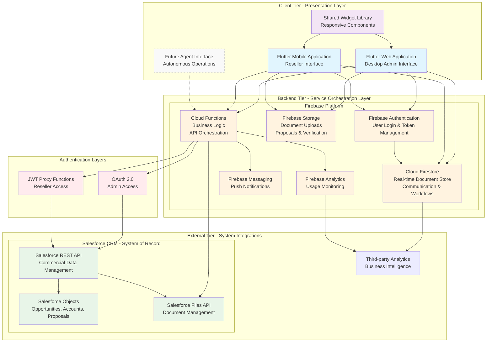

# TwogetherApp Architecture Diagram

## Figure 4.1: Three-Tier System Architecture

## Architecture Principles Implementation

### 1. Single Source of Truth
- **Salesforce CRM** maintains primary ownership of all commercial data
- **Cloud Firestore** provides local caching and real-time user operations
- **Cloud Functions** orchestrate data synchronization and conflict resolution

### 2. Mobile-First Responsive Architecture
- **Flutter Framework** enables unified codebase for web and mobile platforms
- **Shared Widget Library** ensures UI consistency across all interfaces
- **Responsive Design** adapts to reseller smartphones and admin desktops

### 3. Role-Based Access Control
- **Firebase Authentication** with custom claims for role management
- **OAuth 2.0** provides full admin access to Salesforce data
- **JWT Proxy Functions** enable filtered reseller access through Cloud Functions

### 4. Microservices Architecture
- **Domain-specific Cloud Functions** handle isolated business logic
- **Event-driven triggers** respond to user actions and backend events
- **Independent scalability** for each service component

### 5. API-First Integration
- **RESTful API communication** with standardized contracts
- **Decoupled service boundaries** enable platform extensions
- **Future-ready design** supports autonomous agent integration

## Data Flow Patterns

### Admin Workflow
1. Admin authenticates via **Firebase Auth** with **OAuth 2.0** to Salesforce
2. Admin actions trigger **Cloud Functions** with full CRM access
3. Data synchronizes bidirectionally between **Firestore** and **Salesforce**
4. Real-time updates propagate to all connected clients

### Reseller Workflow
1. Reseller authenticates via **Firebase Auth** with role validation
2. Reseller requests trigger **JWT-based Cloud Functions**
3. Functions access **Salesforce** with service account credentials
4. Filtered data returns to reseller interface via **Firestore** caching

### Communication Flow
1. Messages stored in **Cloud Firestore** with real-time synchronization
2. **Firebase Messaging** delivers push notifications
3. **Cloud Functions** handle notification logic and routing
4. **Analytics** track engagement and system usage

## Future Extension Points

The architecture explicitly supports future autonomous agent integration through:
- **Standardized API contracts** for programmatic access
- **Event-driven Cloud Functions** for automated workflow triggers
- **Flexible authentication** supporting service-to-service communication
- **Modular design** enabling independent agent service deployment 