# TwogetherApp - Comprehensive Flow Diagram

## Overall System Architecture and User Flows

```mermaid
graph TB
    %% Entry Points
    Start([App Launch]) --> Auth{Authentication Check}
    
    %% Authentication Flow
    Auth -->|Not Authenticated| Login[Login Page]
    Auth -->|Authenticated| RoleCheck{Check User Role}
    
    Login --> AuthProcess[Firebase Authentication]
    AuthProcess --> FirestoreCheck[Check User Data in Firestore]
    FirestoreCheck --> RoleCheck
    
    %% Role-Based Navigation
    RoleCheck -->|Admin| AdminDash[Admin Dashboard]
    RoleCheck -->|Reseller| ResellerHome[Reseller Home]
    
    %% Admin Features Subgraph
    subgraph AdminFeatures [Admin Features]
        AdminDash --> AdminOpp[Opportunity Management]
        AdminDash --> UserMgmt[User Management]
        AdminDash --> AdminChat[Admin Chat]
        AdminDash --> AdminSettings[Admin Settings]
        AdminDash --> DevTools[Development Tools]
        AdminDash --> AdminStats[Statistics & Analytics]
        
        %% User Management Details
        UserMgmt --> CreateUser[Create New User]
        UserMgmt --> ViewUsers[View User List]
        UserMgmt --> UserDetails[User Details]
        
        CreateUser --> SalesforceSync[Sync with Salesforce]
        CreateUser --> FirebaseUser[Create Firebase User]
        
        %% Opportunity Management Details
        AdminOpp --> CreateOpp[Create Opportunity]
        AdminOpp --> ViewOpps[View Opportunities]
        AdminOpp --> OppDetails[Opportunity Details]
        AdminOpp --> ReviewSubmissions[Review Service Submissions]
        
        CreateOpp --> SalesforceAPI[Salesforce API]
        OppDetails --> SalesforceAPI
        
        %% Admin Chat
        AdminChat --> ViewConversations[View All Conversations]
        AdminChat --> ChatWithResellers[Chat with Resellers]
        
        %% Statistics
        AdminStats --> RevStats[Revenue Statistics]
        AdminStats --> UserStats[User Activity Stats]
        AdminStats --> OppStats[Opportunity Statistics]
    end
    
    %% Reseller Features Subgraph
    subgraph ResellerFeatures [Reseller Features]
        ResellerHome --> Clients[Clients/Opportunities]
        ResellerHome --> Messages[Messages/Chat]
        ResellerHome --> Services[Service Submissions]
        ResellerHome --> ResellerSettings[Settings & Profile]
        
        %% Client/Opportunity Management
        Clients --> ViewOpportunities[View My Opportunities]
        Clients --> OppDetailsRes[Opportunity Details]
        Clients --> ViewProposals[View Proposals]
        Clients --> ProposalDetails[Proposal Details]
        
        OppDetailsRes --> CreateProposal[Create Proposal]
        CreateProposal --> ProposalForm[Proposal Creation Form]
        ProposalForm --> UploadDocs[Upload Documents]
        UploadDocs --> SubmitProposal[Submit to Salesforce]
        
        %% Service Submissions
        Services --> ServiceForm[Service Request Form]
        ServiceForm --> ServiceUpload[Upload Service Documents]
        ServiceUpload --> ServiceSubmit[Submit for Review]
        ServiceSubmit --> AdminReview[Admin Reviews Submission]
        
        %% Messages/Chat
        Messages --> ChatList[View Conversations]
        ChatList --> ChatInterface[Chat with Admin]
        
        %% Settings and Profile
        ResellerSettings --> Profile[View Profile]
        ResellerSettings --> ChangePassword[Change Password]
        ResellerSettings --> ThemeSettings[Theme Settings]
        ResellerSettings --> Logout[Logout]
        
        Profile --> ViewRevenue[View Revenue Data]
        Profile --> ViewCommissions[View Commissions]
    end
    
    %% External Systems Integration
    subgraph ExternalSystems [External Systems]
        SalesforceAPI --> SalesforceOAuth[Salesforce OAuth 2.0<br/>Admin Access]
        SalesforceAPI --> SalesforceJWT[Salesforce JWT Bearer Flow<br/>Reseller Access via Cloud Functions]
        SalesforceAPI --> SalesforceREST[Salesforce REST API v58.0]
        SalesforceAPI --> SalesforceData[Salesforce Data Objects]
        
        SalesforceData --> Opportunities[Opportunities]
        SalesforceData --> Proposals[Proposals CPE]
        SalesforceData --> Accounts[Accounts]
        SalesforceData --> Users[Salesforce Users]
        SalesforceData --> Files[Content/Files]
        
        %% JWT Bearer Flow Details
        subgraph JWTFlow [JWT Bearer Authentication Flow]
            JWTGenerate[Generate JWT Token<br/>iss: consumer_key<br/>sub: integration_user<br/>aud: token_endpoint<br/>exp: expiration]
            JWTSign[Sign with RS256<br/>Private Key]
            JWTRequest[POST to Salesforce<br/>Token Endpoint]
            JWTResponse[Receive Access Token<br/>& Instance URL]
            
            JWTGenerate --> JWTSign
            JWTSign --> JWTRequest
            JWTRequest --> JWTResponse
        end
        
        SalesforceJWT --> JWTFlow
    end
    
    %% Firebase Backend Services
    subgraph FirebaseServices [Firebase Backend]
        FirebaseAuth[Firebase Authentication]
        Firestore[Cloud Firestore]
        FirebaseStorage[Firebase Storage]
        CloudFunctions[Cloud Functions]
        FirebaseMessaging[Firebase Messaging]
        
        %% Firestore Collections
        Firestore --> UsersCollection[users collection]
        Firestore --> ConversationsCollection[conversations collection]
        Firestore --> MessagesCollection[messages subcollection]
        Firestore --> ServicesCollection[service_submissions collection]
        Firestore --> ProvidersCollection[providers collection]
        
        %% Cloud Functions
        CloudFunctions --> UserMgmtFunctions[User Management Functions]
        CloudFunctions --> SalesforceFunctions[Salesforce Integration Functions<br/>Uses JWT Bearer Flow]
        CloudFunctions --> NotificationFunctions[Notification Functions]
        CloudFunctions --> FileFunctions[File Management Functions]
        CloudFunctions --> ChatFunctions[Chat Functions]
        
        %% Specific Cloud Functions with JWT
        SalesforceFunctions --> GetResellerOpps[getResellerOpportunities<br/>JWT → SF API]
        SalesforceFunctions --> GetResellerProposals[getResellerProposalDetails<br/>JWT → SF API]
        SalesforceFunctions --> CreateSfOpp[createSalesforceOpportunity<br/>JWT → SF API]
        SalesforceFunctions --> CreateSfProposal[createSalesforceProposal<br/>JWT → SF API]
        SalesforceFunctions --> DownloadSfFile[downloadFileForReseller<br/>JWT → SF API]
        SalesforceFunctions --> UpdateSfOpp[updateSalesforceOpportunity<br/>JWT → SF API]
        
        UserMgmtFunctions --> CreateFirebaseUser[createUser]
        UserMgmtFunctions --> SetRoleClaim[setRoleClaim]
        
        FileFunctions --> UploadFile[File Upload Handler]
        FileFunctions --> DownloadFile[File Download Handler]
        
        NotificationFunctions --> SendNotification[Send Push Notifications]
        NotificationFunctions --> MessageCleanup[Message Cleanup]
        
        %% Environment Variables for JWT
        CloudFunctions --> EnvVars[Environment Variables<br/>Private Key & Consumer Key<br/>for JWT Authentication]
    end
    
    %% Data Flow Connections
    CreateUser -.-> UserMgmtFunctions
    CreateProposal -.-> SalesforceFunctions
    ServiceSubmit -.-> CloudFunctions
    ChatInterface -.-> Firestore
    ViewOpportunities -.-> GetResellerOpps
    ViewProposals -.-> GetResellerProposals
    
    %% Authentication Flows - Different patterns for Admin vs Reseller
    SalesforceSync -.-> SalesforceOAuth
    FirebaseUser -.-> FirebaseAuth
    
    %% JWT Bearer Flow for Reseller Functions
    GetResellerOpps -.-> SalesforceJWT
    GetResellerProposals -.-> SalesforceJWT
    DownloadSfFile -.-> SalesforceJWT
    CreateSfOpp -.-> SalesforceJWT
    CreateSfProposal -.-> SalesforceJWT
    UpdateSfOpp -.-> SalesforceJWT
    
    %% File Management
    UploadDocs -.-> FirebaseStorage
    ServiceUpload -.-> FirebaseStorage
    DownloadSfFile -.-> SalesforceREST
    
    %% Real-time Features
    ChatInterface -.-> FirebaseMessaging
    ConversationsCollection -.-> ChatInterface
    MessagesCollection -.-> ChatInterface
    
    %% Notifications
    AdminReview -.-> SendNotification
    SubmitProposal -.-> SendNotification
    
    %% Environment Variable Security
    EnvVars -.-> JWTFlow
    
    %% Styling
    classDef adminFeature fill:#e1f5fe
    classDef resellerFeature fill:#f3e5f5
    classDef externalSystem fill:#fff3e0
    classDef firebaseService fill:#e8f5e8
    classDef jwtFlow fill:#fff8e1
    classDef dataFlow stroke-dasharray: 5 5
    
    class AdminDash,AdminOpp,UserMgmt,AdminChat,AdminSettings adminFeature
    class ResellerHome,Clients,Messages,Services,ResellerSettings resellerFeature
    class SalesforceAPI,SalesforceOAuth,SalesforceREST,SalesforceJWT externalSystem
    class FirebaseAuth,Firestore,FirebaseStorage,CloudFunctions firebaseService
    class JWTGenerate,JWTSign,JWTRequest,JWTResponse,EnvVars jwtFlow
```

## Key Application Features Summary

### 1. **Authentication & Authorization**
- Firebase Authentication with email/password
- Role-based access control (Admin vs Reseller)
- **Dual Salesforce Authentication Patterns:**
  - **OAuth 2.0**: For admin users with direct Salesforce access
  - **JWT Bearer Flow**: For reseller access via Cloud Functions with system-level integration user

### 2. **Admin Features**
- **User Management**: Create, view, and manage users with Salesforce integration
- **Opportunity Management**: Create and manage Salesforce opportunities
- **Service Review**: Review and approve reseller service submissions
- **Chat Management**: Communicate with resellers via real-time chat
- **Analytics**: View statistics on revenue, users, and opportunities
- **Development Tools**: Debug and maintenance utilities

### 3. **Reseller Features**
- **Opportunity Viewing**: Access assigned Salesforce opportunities (via JWT-authenticated Cloud Functions)
- **Proposal Creation**: Create and submit proposals with document uploads
- **Service Submissions**: Submit service requests for admin review
- **Chat Communication**: Real-time messaging with administrators
- **Profile & Revenue**: View personal profile and commission data

### 4. **Core Integrations**
- **Salesforce**: Full CRUD operations on Opportunities, Proposals, Accounts, and Files
  - **Admin Access**: Direct OAuth 2.0 authentication
  - **Reseller Access**: JWT Bearer Flow through Cloud Functions for secure, controlled access
- **Firebase**: Authentication, real-time database, file storage, cloud functions
- **File Management**: Upload, download, and view various file types including PDFs
- **Real-time Chat**: Live messaging system with read receipts and notifications

### 5. **Technical Architecture**
- **Frontend**: Flutter (cross-platform: Web, iOS, Android, macOS, Windows)
- **State Management**: Riverpod for reactive state management
- **Navigation**: Go Router for declarative routing
- **Backend**: Firebase Cloud Functions for serverless operations
- **Database**: Cloud Firestore for real-time data synchronization
- **File Storage**: Firebase Storage and Salesforce Content management

### 6. **Security Architecture**
- **JWT Bearer Flow Process**:
  1. Cloud Functions store private key and consumer key as environment variables
  2. Generate JWT with claims (iss: consumer_key, sub: integration_user, aud: token_endpoint, exp: expiration)
  3. Sign JWT with RS256 algorithm using private key
  4. POST signed JWT to Salesforce token endpoint
  5. Receive access_token and instance_url for API calls
  6. Use access_token for authenticated Salesforce REST API operations

This comprehensive flow shows how TwogetherApp serves as a bridge between Salesforce CRM operations and reseller management, with sophisticated authentication patterns ensuring secure access for both admin users (OAuth) and resellers (JWT Bearer Flow via Cloud Functions). 